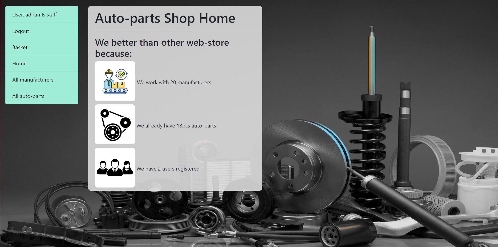

# Auto-parts-shop Project
Django project for searching and buying auto-parts

## Check it out!

[Auto-parts-shop Project developed to Render](https://auto-parts-shop.onrender.com)

## Installation

Python3 already must be installed

```shell
git clone https://github.com/fsocie7y/auto-parts-shop # download project
cd auto-parts-shop # change directory
python3 -m venv venv # create virtual environment
venv\Scripts\activate # if you on Windows
sourse venv/bin/activate # if you on MacOS or Linux
pip install -r requirements.txt # install all requirements
python manage.py migrate #aplly migrations
python manage.py runserver # starts Django server
```

## Features

* SignIn and SignUp functionality for Customer/User
* Buying items from website
* Removing items from basket
* Searching by items and manufacturers
* Powerful admin panel for advanced managing

## Demo


